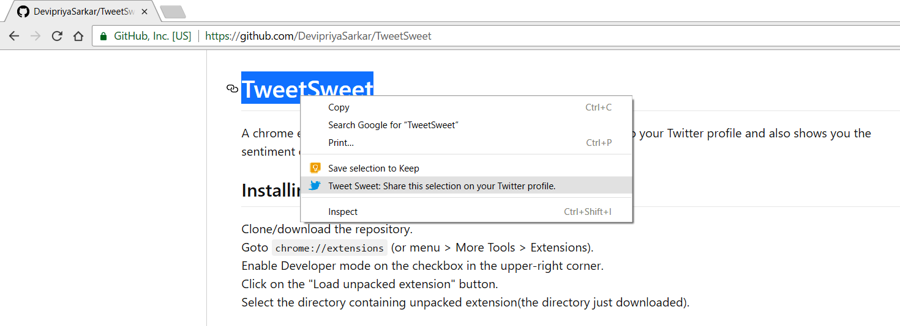

# TweetSweet
A chrome extension that lets you share text, image, link from any page to your Twitter profile and also shows you the sentiment of your tweet before posting.

## Installing unpacked extension
1. Clone/download the repository.  
2. Goto ``` chrome://extensions ``` (or menu >  More Tools > Extensions).  
3. Enable Developer mode on the checkbox in the upper-right corner.  
4. Click on the "Load unpacked extension" button.  
5. Select the directory containing unpacked extension (the directory just downloaded).

## How to use it?
Right click on whatever you want to share and select the Tweet Sweet option on the menu.

## Screenshot


## License
The content of this repository is licensed under [MIT LICENSE](LICENSE).
